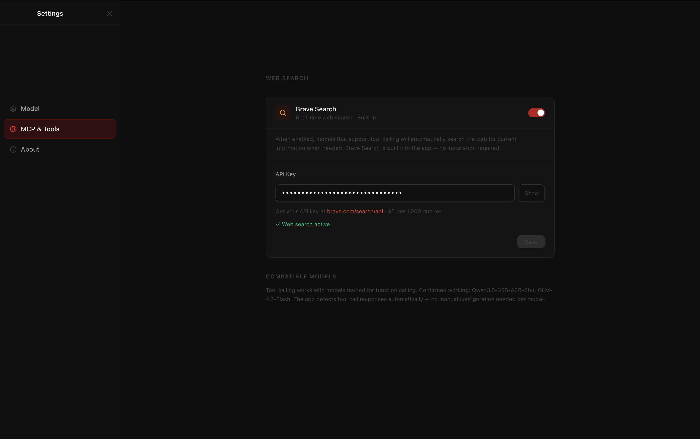
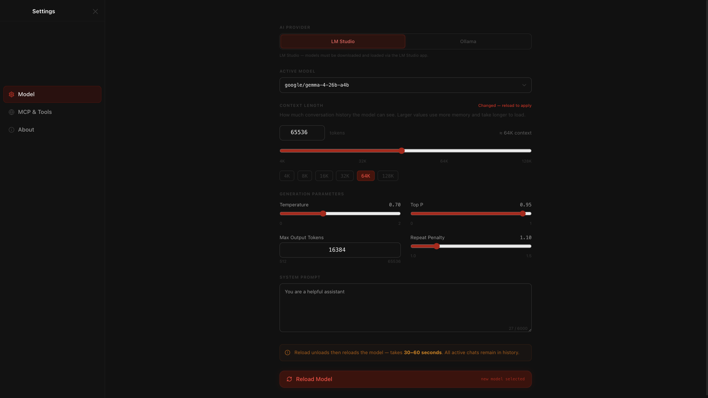
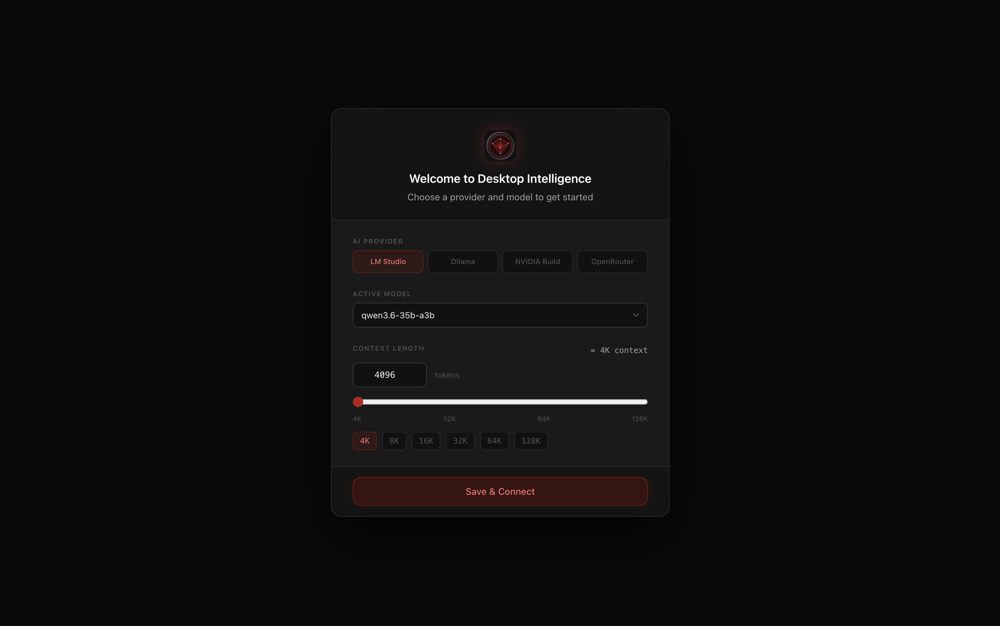

# Changelog

All notable changes to Desktop Intelligence are documented here.

---

## [1.6.2] — 2026-04-05

### Configurable max search rounds
- `MAX_SEARCH_LOOPS` is now user-configurable from Settings → MCP & Tools
- Default value: 4 (previously hardcoded to 1)
- Slider control (range 1–8) appears only when Brave Search is enabled
- Warning shown when value exceeds 5
- Value persisted to `app-settings.json` and read on every request
- DEBUG log confirms the value being used: `[ChatService] Max search loops: N (read from settings)`
- Raising the default from 1 → 4 allows the model to perform follow-up mid-stream searches when the first result doesn't fully answer the question

### Search detection improvements
- Added actionable query signals to `messageNeedsSearch`: courses, recommendations, tutorials, certifications, enrol/enroll, bootcamp, and related terms now trigger Step 1
- Step 1 system message updated to handle mixed queries — if ANY part of the message is actionable or time-sensitive, the model chooses search rather than defaulting to answer

---

## [1.6.1] — 2026-04-05

### Improvement: Structured JSON decision for web search (Step 1)

Replaced the open-ended `tool_calls` / `tool_choice: auto` mechanism in Step 1 with a
`response_format: json_schema` constrained request. LM Studio's grammar sampler forces
the model to emit exactly `{"action":"search","queries":[...]}` or `{"action":"answer"}`.

Benefits:
- Eliminates the 70-tool-call runaway loop that Gemma 4 produced with `tool_choice: auto`
- Step 1 now completes in ~11 tokens regardless of model behaviour
- Removes all Step 1 fallback parsers (raw tool call, code-fence, inline recovery paths)
- Multi-query support preserved — `queries` array passed directly to `executeSearchQueries`
- Graceful fallback: if `response_format` is not honoured, JSON parse fails and the request falls through to Step 2 with no search (safe default)

---

## [1.6.0] — 2026-04-05

### Highlights

- **Gemma 4 full support** — `google/gemma-4-26b-a4b` and the Gemma 4 series work out of the box. Thinking, web search, and streaming all handled natively.
- **Context utilisation indicator** — live progress bar in the top-right corner shows how much of the model's context window is in use, with a hover tooltip showing exact token counts.
- **LaTeX math fixes** — single `$...$` inline math re-enabled with currency dollar protection. Display `$$...$$` blocks normalised to their own lines.
- **Web search stability** — search loop cap, document-chat search suppression, and Step 1 token budget tightened.

### Gemma 4 Support
- `reasoning_content` field read from both streaming (SSE `delta.reasoning_content`) and non-streaming (Step 1 `message.reasoning_content`) LM Studio responses; wrapped in `<think>...</think>` so the existing accordion pipeline handles it with no renderer changes
- Thinking activated via `<|think|>` system prompt token — Gemma's native mechanism; the `thinking: {type}` payload field is not used for Gemma
- `/think` and `/no_think` soft-prompt prefixes skipped for Gemma models — they are Qwen-specific and cause junk text in Gemma's thought accordion if injected
- Format F pipe-delimited tool calls (`<|tool_call>call:brave_web_search{queries:[...]}<tool_call|>`) detected and parsed — queries array preserved, primary query used for search execution
- Step 1 `max_tokens` reduced from 512 → 150 — prevents Gemma from generating runaway tool call loops before the token limit terminates the response

### Context Utilisation Indicator
- `promptTokens` added to `GenerationStats`; populated from `usage.prompt_tokens` in the LM Studio response
- `contextUsage: { used, total } | null` added to `ModelStore`
- `TopBar` renders a slim progress bar with colour transitions (muted → amber → red as context fills); hover tooltip shows exact counts
- Resets on new chat; persists and updates across turns in the same conversation

### Web Search Stability
- `hasDocuments` flag in `ChatSendPayload` suppresses Step 1 web search when a PDF is attached — RAG answers the question, not the web
- `MAX_SEARCH_LOOPS` reduced 3 → 1; explicit error message shown when the limit is hit rather than silent hallucination
- Search loop exhaustion guard: if the loop exits with zero tokens delivered, a user-facing error is sent instead of an empty response

### Bug Fixes
- Duplicate system prompt content in PDF chat requests — `BASE_SYSTEM_PROMPT` was being added by both `handlers.ts` and `ChatService.buildMessages()`; removed from `handlers.ts`
- Duplicate RAG document content — `docInjections` in `buildMessages()` and the RAG system message in `handlers.ts` both injected the same PDF text; `docInjections` path removed
- `reasoning_content` from Step 1 non-streaming response was silently dropped — thinking accordion never showed on direct answers; fixed by reconstructing `<think>...</think>` from the field before passing to `streamContentInChunks`

---

## [1.6.0-alpha-4] — 2026-04-02

### Search Repetition and Context Deduplication

- **Context Optimization**: Modified the wire payloads to explicitly push `tool` messages and tool_calls to the LLM backend rather than injecting them via System Notes. Introduced pruning logic into `ChatService.ts` that detects subsequent tool outputs across historical turns and stubs them to `[Previous Search Results for query]`, radically shrinking the size of old web search snippets across conversational turns.
- **Removed Double Search Execution**: Eliminated duplicate legacy fallback functions (`detectSearchIntent`) from generic IPC payloads in favor of uniform MCP protocol streaming.
- **Clean Assistant Context**: Automatically filters out previously injected textual tool footprints (`[System Note: ...]`) using `cleanAssistantHistory` to eliminate artifact bloat.
- **Improved Typewriter Animation Sync**: Prevented early chunks from flashing without the typewriter animation during non-stream tool detection branches and effectively applied `<think>` block truncations directly inside the output streams.
- **Conversational Follow-up Avoidance**: Expanded `messageNeedsSearch` to explicitly abandon checks on short generic texts (under 3 words with no Proper Nouns) to prevent the intelligence module from initiating real-time search on follow-up phrases like "tell me more" or "seriously?".

---
## [1.6.0-alpha-3] — 2026-04-02

### Bug Fixes

#### Mid-Stream Tool Call Leak
When models emitted a mid-stream tool call using Qwen's specific XML-like syntax (`<function=...><parameter=...></parameter></function>`), the raw parser failed to recognize it. This resulted in the streaming mechanism failing to intercept the tool call, allowing the raw XML to leak into the UI. Support for this format has been added to `parseRawToolCall`, and the stream cutoff heuristic has been updated to detect `</parameter>`, cleanly halting generation and extracting the query in real time.

---

## [1.6.0-alpha-1] — 2026-04-01

### Highlights

- **Brave Search MCP tool calling** — the app can now perform real-time web searches before answering time-sensitive questions. Requires a free [Brave Search API key](https://brave.com/search/api/) configured in settings.
- **Full-screen Settings panel** — the settings modal is replaced by a proper full-screen panel with a left-nav tab layout: Model, Web Search (MCP), and About.
- **Think-block rendering fixes** — multiple regressions in `<think>` block parsing fixed, including the critical duplication bug where content appeared in both the accordion and the main chat body.
- **Finance charts with live data** — `yfinance` is pre-installed and available in matplotlib code blocks for live stock and market data charts.

---

### New Features

#### Brave Search MCP (Web Search Tool)

Real-time web search powered by the [Brave Search API](https://brave.com/search/api/). When enabled:

- A **two-step request** pattern is used: a non-streaming Step 1 detects whether the model wants to call the search tool (512 token budget, thinking disabled); if a tool call is requested, the search executes and the results are injected before streaming the final answer.
- A **smart trigger heuristic** (`messageNeedsSearch`) limits Step 1 to queries that genuinely need live data — explicit keywords (`search`, `latest`, `current`, `today`), time-sensitive domains (prices, stock tickers, weather, election results), recency signals (`recent`, `2025`, `2026`), and proper nouns with recency context. Knowledge questions, coding help, and philosophy skip Step 1 entirely.
- A **raw tool call fallback parser** handles models that emit `<tool_call>` XML in the content field rather than structured `tool_calls` — results are injected identically; the markup never reaches the UI.
- Search results snippets are **sanitised** (markdown syntax stripped) before injection so formatting characters in snippets don't bleed into the rendered response.
- **Search notification UI**: a searching spinner appears while the query is in flight; on completion, a collapsible pill shows the query and up to 5 source links; errors display a concise error card.
- Search notifications **persist across chat switching** — the "Searched the web" pill is saved to SQLite alongside the message and restored when you re-open a conversation.
- **Adaptive thinking budget**: when a search was performed, Step 2 uses a 4 000-token thinking budget; without search, 8 000 tokens — avoiding unnecessary token burn on simple post-search synthesis.



#### Full-Screen Settings Panel

The floating settings modal is replaced with a proper full-screen settings page that opens when you click ⚙️ in the sidebar. The sidebar and chat are not rendered while settings is open.

- **Left-nav tab layout** with three tabs: **Model**, **Web Search**, **About**
- Model tab: active model name, context length slider/presets, Reload Model button
- Web Search tab: Brave Search toggle, API key input (password field with show/hide), save button, unsaved-changes indicator, live green/amber key-status dot



- About tab: app version, author, link to changelog

#### Finance Charts with Live Data

`yfinance` is now available in matplotlib code blocks as the pre-imported alias `yf`. The worker pre-flight check installs it automatically if missing (`pip3 install yfinance`). Ask the model for a live stock chart and it will fetch real OHLCV data via `yf.Ticker().history()`.

---

### Bug Fixes

#### Critical: Think-Block Content Duplication
`stripLeadingThinkClose()` was incorrectly applied to **every** SSE delta chunk. Qwen3 and GLM models emit `</think>` as its own standalone chunk; stripping it on every iteration swallowed the token, leaving the `<think>` block unclosed. `parseThinkBlocks(content, true)` then hit Case 3 recovery (`answer = thought = full content`), causing the entire response to appear in both the thinking accordion and the main chat body simultaneously.

**Fix:** `stripLeadingThinkClose()` is now gated by a `firstChunkProcessed` flag and runs only on the very first delta chunk of each stream, where an orphaned `</think>` can legitimately appear as a Step 1 leak.

#### Think-Block Truncation Recovery
When the model's think block is truncated by `max_tokens` (stream ends with `<think>` still open), `parseThinkBlocks` previously returned `answer: ''` — leaving the user with a blank response card. The new `streamEnded` parameter (passed as `!isStreaming` from `MarkdownRenderer`) enables Case 3 recovery: the thought content is surfaced as the answer so the user always sees something.

#### Merged Text / Missing Spaces in Responses
`stripLeadingThinkClose()` originally called `.trimStart()` after the regex replacement. Whitespace-only delta chunks (e.g. `"\n\n"`) matched nothing in the regex but `.trimStart()` still ran, converting them to `""`. Those chunks were then skipped by the `if (!cleanedDelta) continue` guard, stripping all paragraph breaks and spacing from responses. `.trimStart()` was removed.

#### Step 1 Thinking Mode Waste (~11s TTFT)
Step 1 (tool-detection round) previously ran with the same thinking settings as Step 2 — the model spent up to 8 000 thinking tokens deciding whether to call a tool, adding ~11 seconds before any content reached the user. Step 1 now uses a completely separate body: `thinking: disabled`, `temperature: 0.1`, `max_tokens: 512`.

#### GLM-4 / Non-Qwen Structured CoT Leak
Models like GLM-4.7-flash output numbered CoT steps ("1. Analyze the Request…") as plain text **outside** `</think>`. This rendered to the user verbatim. A `THINKING RULE` was added to the base system prompt: all reasoning must stay inside `<think>…</think>`; no numbered analysis steps outside the block, even after web search.

#### Dollar Signs Rendered as LaTeX
`$164.65 to $174.63` was being passed to KaTeX as math expressions and rendered as broken LaTeX. Fixed by passing `{ singleDollarTextMath: false }` to the `remarkMath` plugin — `$...$` inline math is disabled; `$$...$$` block math is unaffected.

#### Typewriter Animation Missing on Direct Answers
When `messageNeedsSearch()` fired Step 1 but the model answered directly (no tool call), the entire response was emitted as a single chunk followed immediately by `CHAT_STREAM_END`. React batched both updates; `isStreaming` never rendered as `true`; the typewriter cursor never appeared. Fixed by the new `streamContentInChunks()` helper that sends direct-answer content in 80-character chunks at 16ms intervals, preserving the streaming animation.

#### Date Awareness in Queries
Models were composing search queries using their training-cutoff year instead of the current date. The current date and time are now prepended to the system prompt on every request via `buildMessages()`.

#### MCP Settings Persistence
`MCP_SAVE_SETTINGS` was spreading `undefined` values that silently erased the API key on every toggle change. The handler now builds a clean patch of only the defined fields before merging into the settings store.

---

### Improvements

- **System prompt token budget** relaxed from 3 000 → 3 500 characters to accommodate the new THINKING RULE and improved guidance without compression artefacts
- **`pandas` unblocked** — removed from the Python sandbox banned-imports list; `yfinance` uses it internally and the model itself still writes `numpy`-first code
- **Brave Search result sanitisation** — `**`, `*`, `__`, `_`, and backtick characters are stripped from snippet text before injection, preventing formatting bleed
- **45-second think-block timeout** — if a `<think>` block has been open for more than 45 seconds without closing, the stream is automatically aborted (belt-and-suspenders guard for runaway thinking)
- **Search error cards are transient** — if a search error occurred but the model produced a valid answer from its own knowledge, the error notification is cleared at stream end so it doesn't pollute the chat

---

## [1.5.1] — 2026-03-30

### Bug Fixes

#### Mermaid Mindmap — Missing Header Auto-Recovery
Models frequently omit the required `mindmap` keyword on the first line of a mindmap block, jumping straight to `root((Title))`. Previously this caused an immediate parse error with no diagram shown. The renderer now detects this pattern and silently prepends the missing `mindmap` header before passing the code to Mermaid — the diagram renders correctly without the user seeing any error.

#### Mermaid Mindmap — Syntax Rules in System Prompt
Two new rules added to the system prompt to prevent the most common mindmap errors:
- The model is explicitly instructed that the first line of a mindmap block **must** be `mindmap` — never skip straight to `root()`
- Node labels must be plain text only — no `^`, `/`, or math expressions (e.g. write `"QK transpose"` not `"QK^T"`)

---

## [1.5.0] — 2026-03-30

This is the first stable release. It represents the full feature-complete build as of March 2026 and is the recommended version for daily use.

### Highlights

- **Model-agnostic** — works with any model you have downloaded in LM Studio. Pick it from a dropdown on first launch; switch models at runtime from the settings pane.
- **Native matplotlib charts** — rendered via a persistent Python worker process (~200ms render time vs 3–4s cold-start in earlier builds).
- **Per-block chart execution** — in multi-chart responses, each chart starts rendering as soon as its code block is complete, not waiting for the entire response to finish.
- **Mermaid mindmaps** — hierarchical diagrams (taxonomies, concept maps, topic trees) now render as SVG via `mindmap` blocks.

---

### New Features

#### First-Launch Onboarding & Model Selector
On first launch, a welcome screen prompts you to choose any model you have downloaded in LM Studio and set your initial context length. Your selection is saved and applied automatically on every subsequent launch — no manual LM Studio configuration needed.



#### Settings Pane (⚙️)
- Change your active model or context length at runtime without restarting the app
- Slider with preset chips: 4K / 8K / 16K / 32K / 64K / 128K
- Reload runs `lms unload --all` → `lms load <model> --context-length <N>` via the CLI
- Your chosen context length persists across app restarts

#### Persistent Python Worker
The matplotlib rendering pipeline now keeps a warm Python process alive for the lifetime of the app session. Imports (`numpy`, `matplotlib`, `scipy`) happen once at startup; each chart render pays only for user code execution.

- **Before:** 3–4 second cold-start per chart
- **After:** ~200ms per chart after first load
- Multiple charts in a single response are queued (FIFO) on the warm worker — no fallback to slow one-shot spawns

#### Per-Block Chart Stabilisation
Charts no longer wait for the entire response to finish streaming before rendering. Each code block is monitored independently: 800ms of code-content stability while the model is still writing signals that the closing ` ``` ` has been received, and execution begins immediately. Chart 1 can be rendering while the model is still writing Chart 2's prose.

#### Thinking / Fast Mode Toggle
- **Thinking mode** (🧠): enables chain-of-thought reasoning (`budget_tokens: 8000`). Best for complex tasks — code review, document analysis, multi-step math.
- **Fast mode** (⚡): direct responses with no reasoning step. Lower latency for conversational queries.
- Toggle is in the input bar; switching mid-conversation inserts a labelled divider.
- Mode auto-elevates to Thinking when a PDF or image is attached.
- `<think>...</think>` blocks are stripped from conversation history before re-sending to the model — recovers 60–80% of the context they would otherwise occupy.

#### Mermaid Mindmaps & Extended Diagram Types
- `mindmap` added as a supported Mermaid diagram type — renders hierarchical concept maps, taxonomies, and topic trees as native SVG
- ASCII box-drawing trees (`├──`, `└──`) are explicitly banned from prose output; the model is instructed to use `mindmap` instead

---

### Improvements

#### Chart Safety Shims (worker_harness.py)
The Python execution environment now includes additional runtime guards:

| Shim | What it fixes |
|------|--------------|
| `_safe_barh` / `_safe_bar` | Auto-converts Python list labels to `np.array` before axis calls — prevents `TypeError: only integer scalar arrays can be converted to a scalar index` |
| `_safe_scatter` | Truncates mismatched `x`/`y` arrays to `min(len(x), len(y))` — prevents `ValueError: x and y must be the same size` |
| `_safe_plot` | Same truncation for two-argument `plot(x, y)` calls |
| `_FlexAxes` | Out-of-bounds subplot axis access returns a hidden off-screen axis instead of `IndexError` |
| `_fix_cov()` | 1-D covariance vectors auto-promoted to diagonal 2×2 matrices for GMM/multivariate normal calls |
| `_mvn_safe_pdf()` | Misshapen meshgrid arrays `(d, N)` auto-transposed to `(N, d)` |
| `_auto_norm_imshow()` | 2D float arrays auto-normalised to `[min, max]` — prevents washed-out feature maps |

#### exec Scope Fix
The Python worker's `execute_chart()` now runs user code with `dict(globals())` as the exec namespace, so all pre-imported names and shims are available to user code without explicit imports. Each render gets a fresh copy of the namespace — no cross-request pollution.

#### False-Positive "Offline" Overlay Fix
The connection health check requires **two consecutive** failures before showing the offline overlay. A single timeout during GPU-intensive generation is silently absorbed. The overlay now reliably represents a genuine disconnect.

#### History Window Trimming
Conversation history is capped at 20 messages before being sent to LM Studio. This prevents context overflow in long sessions, particularly important when large base64 chart images are part of the history.

#### Empty Response Guard
If the LM Studio stream produces zero tokens, the app emits a human-readable error message instead of silently hanging.

---

### Bug Fixes

- **"MODEL" shown on startup instead of model name** — `SETTINGS_GET_MODEL` now reads `modelId` directly from the settings store rather than parsing `lms ps` output, eliminating regex mismatches against table headers.
- **RAG context not injected** — fire-and-forget ingest replaced with `await`; `chat_id` race on first message fixed by pre-creating the chat row before PDF processing begins.
- **Runaway generation loop** — `stop` sequences array added to every LM Studio payload; client-side repetition detector aborts the stream if the same line appears 3+ consecutive times.
- **Mermaid `antiscript` security level** — switched to `loose` to prevent DOMPurify from stripping SVG `xmlns` attributes in the Electron renderer.
- **`<think>` leak on models that mention `</think>` mid-thought** — regex switched from non-greedy (first match) to `lastIndexOf` (final match), so thought content never leaks into the answer area.
- **False-positive offline during PDF generation** — health-check timeout raised 5s → 8s; consecutive-failure threshold set to 2.

---

### Reliability & Safety

- **Stop sequences** included in every LM Studio payload: `<|im_end|>`, `<|endoftext|>`, and common loop-trigger phrases.
- **Banned imports** in the Python sandbox: `sklearn`, `pandas`, `seaborn`, `torch`, `tensorflow`, `keras` — raise a clear `ImportError` immediately.
- **`matplotlib.use()`** patched to no-op — prevents crash if model code calls it after `Agg` is already set.
- **`suptitle(pad=...)`** patched to silently drop the invalid kwarg.
- **Worker auto-restart** — if the Python worker crashes unexpectedly, it restarts automatically after 1 second. Any in-flight render falls back to a one-shot spawn.

---

## [1.0.0] — 2026-03-21

Initial scaffold. Core Electron + React + Vite + TypeScript application with:

- Streaming chat via LM Studio `/v1/chat/completions`
- SQLite chat history (better-sqlite3)
- PDF attachment and text extraction (pdf-parse)
- IPC file transfer via ArrayBuffer
- LM Studio daemon management with exponential-backoff health polling
- Base Markdown rendering, syntax highlighting, KaTeX math
- Mermaid SVG diagrams

---

*For a detailed technical change log, see [CLAUDE.md](CLAUDE.md) Section 0.*

### Core Agentic Logic Updates
*   **Resolved `<think>` Tag UI Bleed:** Addressed an edge-case regression during mid-stream tool execution where a partially generated unclosed `<think>` tag would persist in the message UI state, forcing the `MarkdownRenderer` to apply Case 3 retrieval and resulting in duplicated text. The orchestration loop now proactively closes mismatched `think` tags before dispatching `CHAT_STREAM_RETRACT`.
*   **Persistent Tool-Call Context Memory:** Resolved a model "amnesia" hallucination issue across multi-turn prompts (e.g., repeating searches for stale context) by injecting a dynamically generated `[System Note: ...]` detailing the parsed query and results of prior inline tool calls into the internal `.content` tracker. Ensures model retains explicit awareness of its prior functional executions while preserving frontend isolation.
