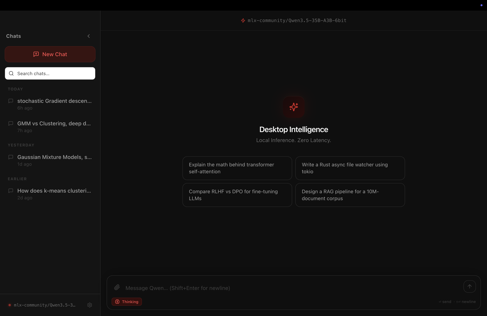
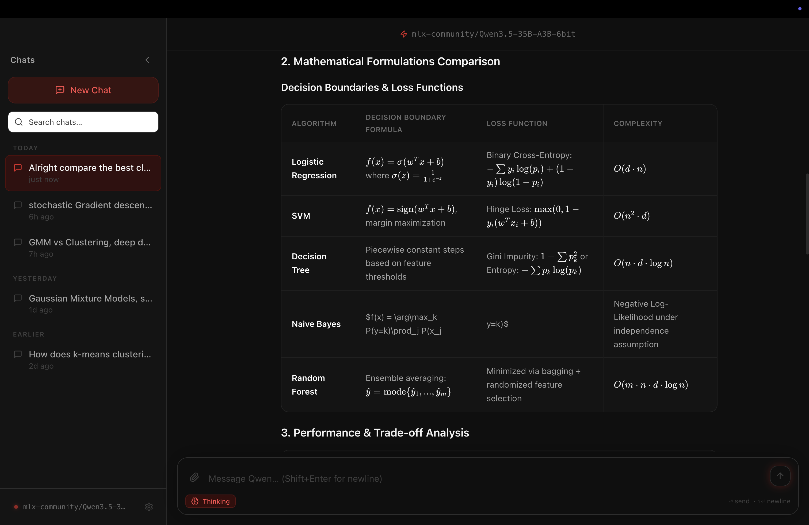
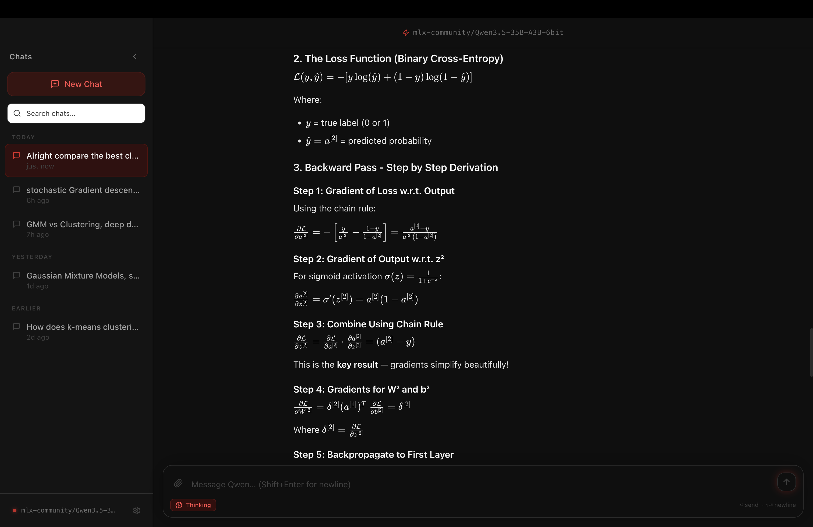
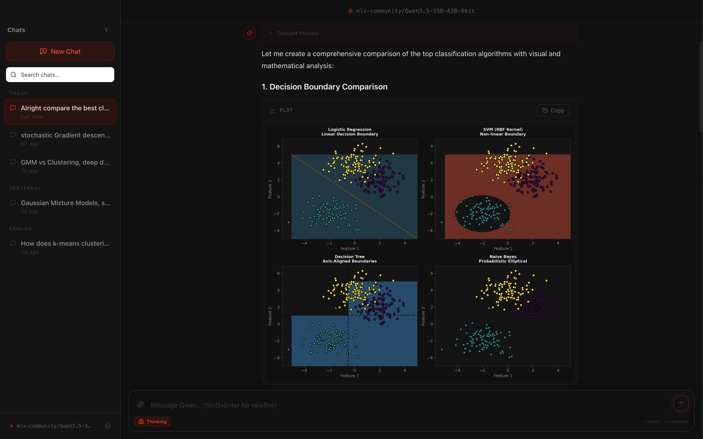
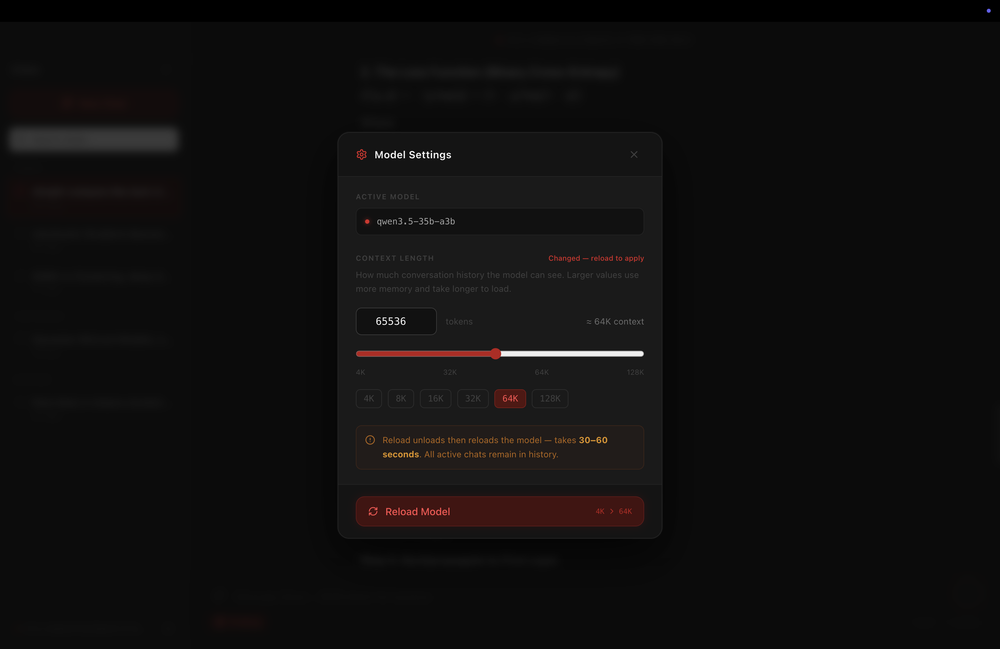

# Desktop Intelligence

> **Local Inference. Zero Latency.**

A native macOS desktop chat application that runs large language models entirely on your machine via [LM Studio](https://lmstudio.ai/). No cloud. No API keys. Full privacy.

---

## ⚠️ Hardware Requirements

> **This application runs a 35-billion-parameter AI model entirely on-device and requires significant system memory.**
>
> | RAM | Status |
> |-----|--------|
> | **64 GB+** | ✅ Ideal — full performance, comfortable headroom |
> | **48 GB** | ✅ Recommended minimum |
> | **< 48 GB** | ❌ Not recommended — the model alone requires ~29 GB free memory; lower RAM will cause crashes or severe performance degradation |
>
> **Apple Silicon (M-series) only.** Intel Macs are not supported.

---



---

## What is this?

Built for **Apple Silicon** (M-series) with `mlx-community/Qwen3.5-35B-A3B-6bit` as the primary model, sustaining **~71 tokens/second** on an M5 Pro. Fully offline — everything runs on your machine.

- 📋 **[Full Feature List →](FEATURES.md)** — chat, RAG, visualizations, diagrams, math rendering, thinking mode, and more
- 🚀 **[Installation Guide →](INSTALLATION.md)** — install LM Studio, download the model, and get running in minutes

---

## Screenshots

### Markdown, Code & Math



Full Markdown rendering with syntax-highlighted code blocks, tables, and task lists. LaTeX math via KaTeX.



### Native Data Visualizations



Ask the model to plot anything — distributions, decision boundaries, neural network activations, time series. Charts render natively via a `python3` subprocess with `matplotlib`, styled to match the dark UI.

### Model Settings



Adjust the model's context window at runtime. Your preference is persisted across restarts — the model reloads with your chosen `n_ctx` on every launch.

---

## Quick Start (Development)

> **End users: see [INSTALLATION.md](INSTALLATION.md) instead.**

```bash
# Install dependencies
npm install

# Start in development mode (Electron + Vite hot-reload)
npm run dev

# Run the test suite
npm test

# Build a production DMG
npm run package
```

The packaged app outputs to `dist/Desktop Intelligence-1.0.0-arm64.dmg`.

---

## Tech Stack

| Layer | Technology |
|---|---|
| Shell | Electron 31 |
| Frontend | React 18 + Vite + TypeScript (strict) |
| Styling | Tailwind CSS v3 + shadcn/ui |
| Markdown | react-markdown + remark-gfm + remark-math + rehype-katex |
| Diagrams | Mermaid 11 (native SVG) |
| Syntax highlighting | highlight.js |
| Database | better-sqlite3 (SQLite) |
| AI backend | LM Studio (`/v1/chat/completions`, OpenAI-compatible SSE) |
| Visualizations | matplotlib via python3 subprocess |
| PDF parsing | pdf-parse |
| Packaging | electron-builder (macOS arm64 DMG) |

---

## Architecture Overview

```
Renderer (React)          Main Process (Node/Electron)
─────────────────         ──────────────────────────────
Layout / ChatArea         IPC handlers
MessageBubble             ├── FileProcessorService  (PDF → SQLite)
MarkdownRenderer          ├── RAGService            (SQLite full-text retrieval)
  ├── MermaidBlock        ├── ChatService           (SSE streaming → renderer)
  └── MatplotlibBlock     ├── SystemPromptService   (base prompt injection)
InputBar                  ├── DatabaseService       (chat history)
ModelStore (Context)      └── SettingsStore         (context-length persistence)
                          Managers
                          ├── ModelConnectionManager (health polling)
                          └── LMSDaemonManager       (lms CLI lifecycle)
```

All heavy work (PDF parsing, database writes, Python rendering, LM Studio API calls) runs in the Electron main process. The renderer is purely presentational and communicates exclusively through typed IPC channels via `contextBridge`.

---

## Debugging (Packaged App)

Since Electron swallows stdout in the packaged `.app`, launch from Terminal to see logs:

```bash
/Applications/"Desktop Intelligence.app"/Contents/MacOS/"Desktop Intelligence"
```

Key sentinel log lines:

| Log prefix | Meaning |
|---|---|
| `[FileProcessor] 📄` | File received and being processed |
| `📄 PDF-PARSE EXTRACTED CHARACTERS:` | PDF text extraction succeeded |
| `[RAG] 🧠 ingestDocument` | Document being written to SQLite |
| `🔥 VECTOR DB RESULTS COUNT:` | RAG retrieval result count |
| `🚀 FINAL LM STUDIO PAYLOAD:` | Full JSON sent to LM Studio |
| `[Python] ✅ matplotlib render OK` | Chart rendered successfully |
| `[Settings] ✅ Reload complete` | Model reloaded with new context length |

---

Built with [Claude Code](https://claude.ai/claude-code)
