# Desktop Intelligence

> **One Interface. Every model.**

A native macOS desktop chat application that connects to local models via [LM Studio](https://lmstudio.ai/) or any cloud inference backend — NVIDIA Build, Ollama, or OpenRouter. Run fully offline for maximum privacy, or connect to a cloud API when you need more firepower.

---

## ⚠️ Local Inference — Hardware Requirements & Disclaimer

> **The hardware requirements below apply only when using LM Studio (local inference). Cloud backends — NVIDIA Build, Ollama, OpenRouter — have no special hardware requirements beyond what the app itself needs.**
>
> **When running local models, memory requirements depend on the model you choose.**
>
> | RAM         | Status                                                                     |
> | ----------- | -------------------------------------------------------------------------- |
> | **64 GB+**  | ✅ Ideal — runs large MoE models (35B+) with full performance and headroom |
> | **48 GB**   | ✅ Recommended minimum for large models                                    |
> | **32 GB**   | ⚠️ Workable with smaller models (7B–14B); avoid loading 35B+ models        |
> | **< 32 GB** | ❌ Not recommended — insufficient for most capable models                  |
>
> **Apple Silicon (M-series) only.** Intel Macs are not supported.

**Local LLM inference (LM Studio only) is computationally intensive and generates significant heat.** Running large models puts sustained load on your SoC in ways typical workloads do not. On Apple Silicon MacBooks, lighter models (3B–14B) run warm but manageable; dense 27B+ models cause the machine to run **very hot** with prolonged use. Ensure your machine has adequate ventilation and do not run intensive models on a blocked or poorly ventilated surface for extended periods. Cloud backends generate no local heat and have no hardware constraints.

This project was built for **personal use and learning** on the author's own hardware. It is not a polished commercial product and is not recommended unless you understand what you're doing. The author accepts **no responsibility** for hardware damage, thermal throttling, reduced component lifespan, or any other adverse effects resulting from running this software. **Use at your own risk.**

---


---

## What is this?

Built for **Apple Silicon** (M-series). Supports four inference backends — switch between them from Settings at any time:

| Backend | Description |
|---|---|
| **LM Studio** | Local inference via MLX. Fully offline, maximum privacy. Requires the `lms` CLI. |
| **Ollama** | Local inference via Ollama. Point at any running Ollama instance. |
| **NVIDIA Build** | Cloud inference via NVIDIA's free API tier. No local model needed. |
| **OpenRouter** | Cloud inference via OpenRouter — access hundreds of models with one API key. |

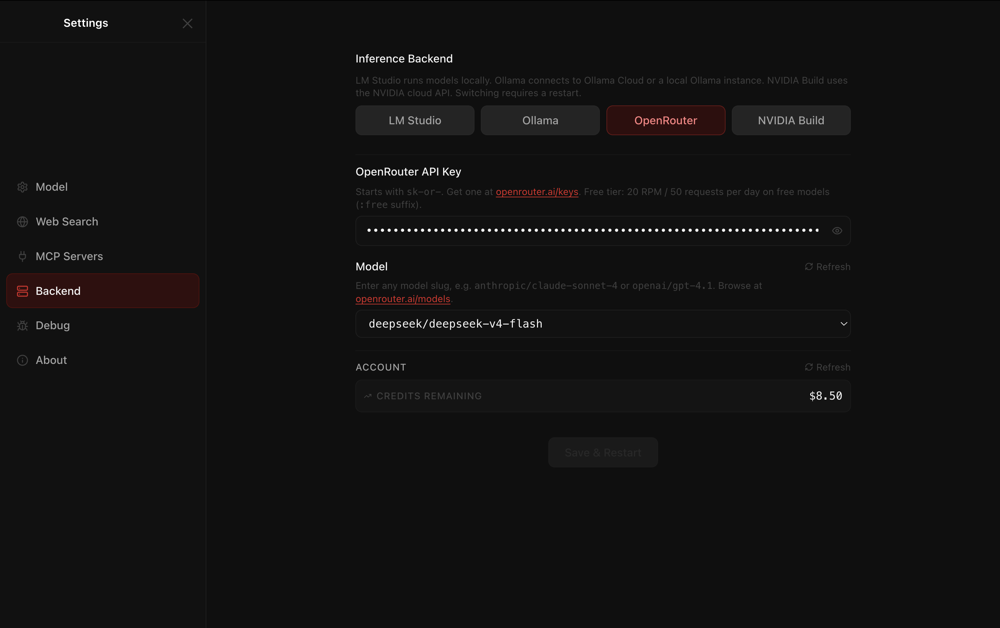

Tested with `mlx-community/Qwen3.5-35B-A3B-6bit` via LM Studio, sustaining **~71 tokens/second** on an M5 Pro. Gemma 4 (`google/gemma-4-26b-a4b`) is the current top pick for local reasoning and vision.

- 📋 **[Full Feature List →](FEATURES.md)** — chat, RAG, visualizations, diagrams, math rendering, thinking mode, web search, and more
- 🚀 **[Installation Guide →](INSTALLATION.md)** — download LM Studio, grab a model, and get running in minutes
- 📝 **[Changelog →](CHANGELOG.md)** — what's new in each release

---

## Screenshots

### First Launch — Model Selection


On first launch, select any model you have downloaded in LM Studio and set your initial context window. Your selection is saved and applied automatically on every subsequent launch.

> ⚠️ **RAM note:** Large models (35B+) require 48 GB of unified memory or more. Loading a 35B model at 128K context can use 40–55 GB of RAM — other apps will be compressed. On 32 GB machines, stick to 7B–14B parameter models.

---

### Rich Text Formatting — User & Assistant Bubbles

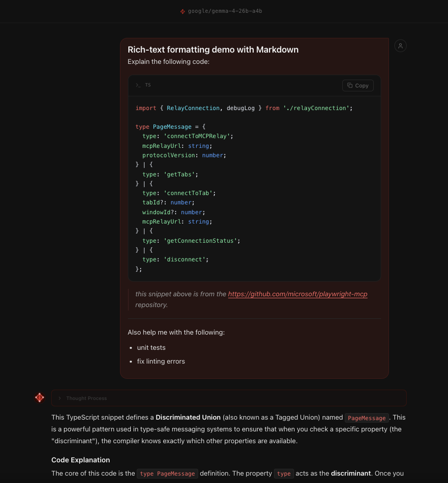

**User messages are now fully rendered** — Markdown headings, bold/italic, code blocks, lists, and tables display correctly in user bubbles, not as raw text. Assistant responses support the same full Markdown suite alongside LaTeX math, Mermaid diagrams, and syntax-highlighted code.

### Markdown, Code & Math


Full Markdown rendering with syntax-highlighted code blocks, tables, and task lists. LaTeX math via KaTeX.


### Native Data Visualizations


Ask the model to plot anything — distributions, decision boundaries, neural network activations, time series. Charts render natively via a `python3` subprocess with `matplotlib`, styled to match the dark UI.

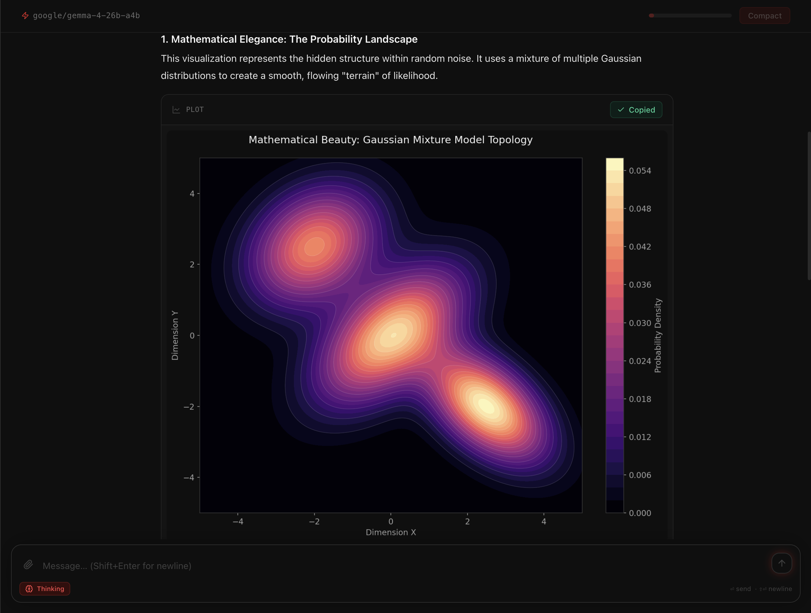

### Settings — Model & Generation Parameters


Change your active model, adjust the context window, and tune generation parameters (Temperature, Top P, Max Output Tokens, Repeat Penalty) — all from the Settings panel (⚙️). Set a **custom system prompt** to give the model persistent instructions. All choices persist across restarts.

### Settings — MCP (Model Context Protocol)

Desktop Intelligence supports the [Model Context Protocol (MCP)](https://modelcontextprotocol.io/) — an open standard that lets the app call external tools and services on demand. MCP servers are configured from the Settings panel, then invoked by the model during chat.

**Add a new MCP server using the form:**

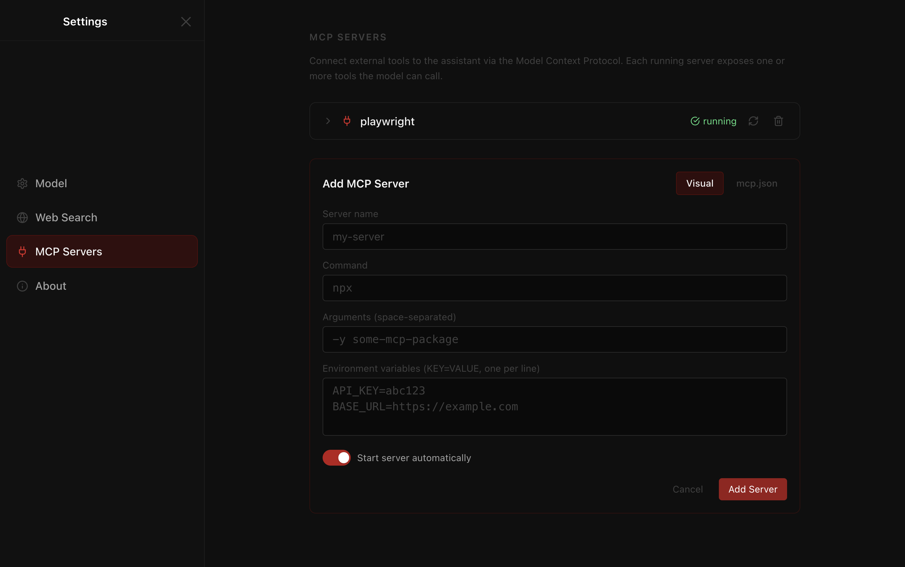

Fill in a name, URL or command, and any required parameters. Click **Add** to register the server.

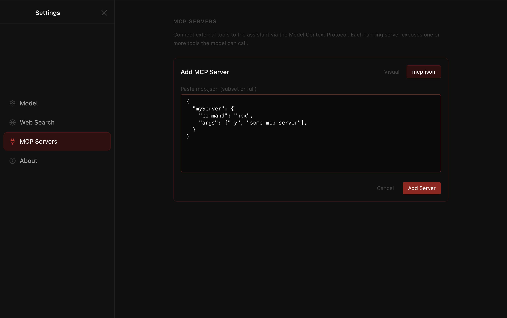

Alternatively, paste a raw MCP server configuration in JSON format for more advanced setups — ideal when you have a server definition from documentation or want to batch-import multiple servers.

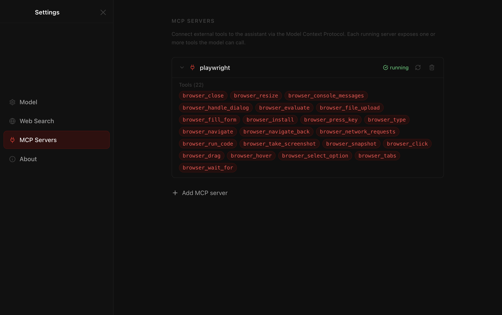

Once added, each MCP server appears as a card in the settings list with its name and status. You can toggle individual servers on or off, edit their configuration, or remove them.

Additionally, if an MCP server exposes extra tools, some can be disabled as necessary:

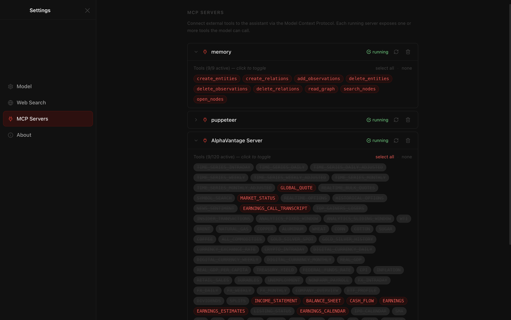

### Built-in Brave Search MCP

**Brave Search** is provided as a built-in MCP server (see the Web Search tab).


Enable real-time web search by pasting your [Brave Search API key](https://brave.com/search/api/). The app performs a targeted search before answering time-sensitive questions — results are injected into the model's context, never hallucinated.

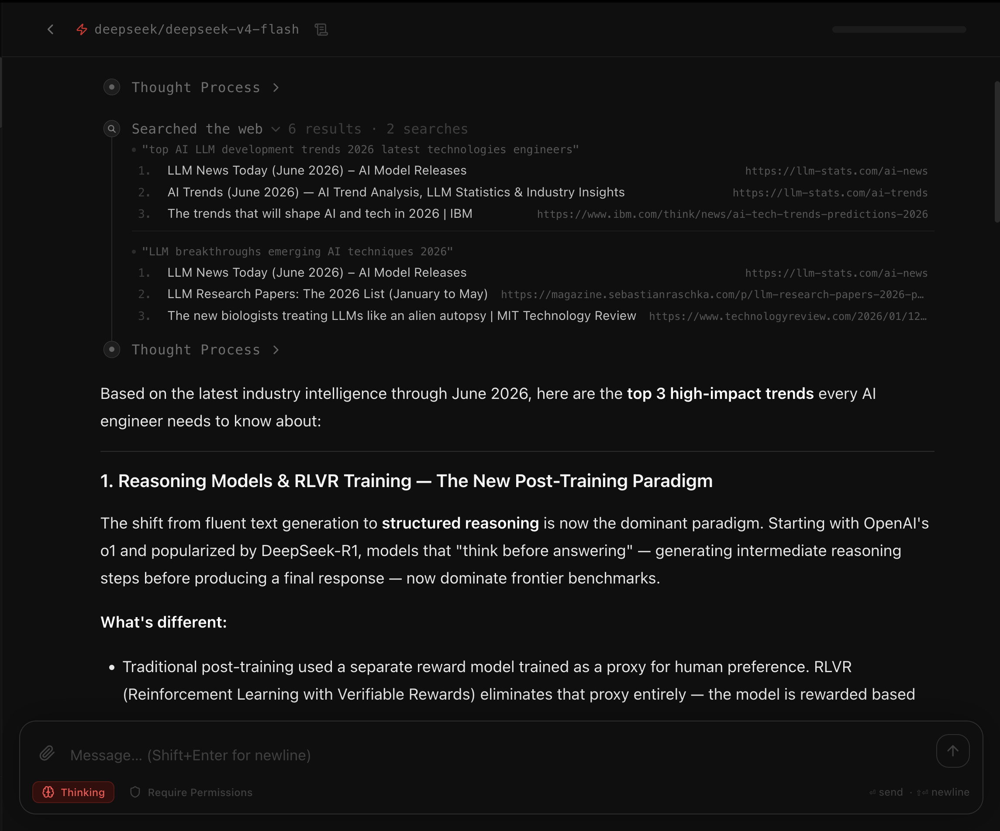

### MCP Tool Calls in Chat

When the model decides to use an MCP tool during a conversation, the call is rendered inline — you can see which tool was invoked and its result without leaving the chat.

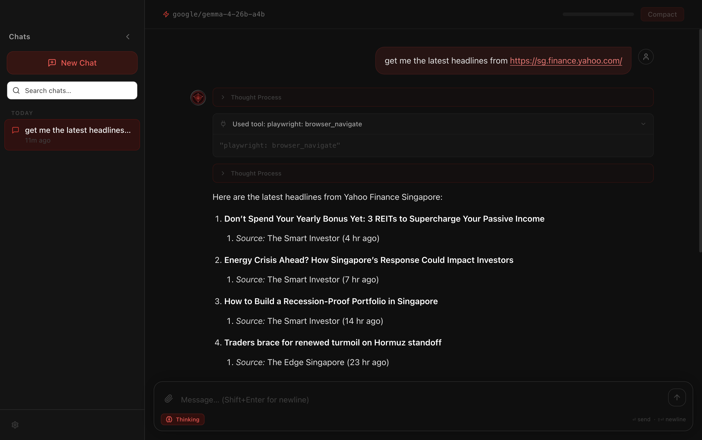

Tool invocations are handled transparently: the app sends the request to the MCP server, captures the result, and feeds it back into the model's context. The user sees a clean, structured representation of each tool call and its output.

### Human In The Loop (HITL) — MCP Tool Approval

Desktop Intelligence gives you complete control over what MCP tools the model can call, and when. The Human In The Loop system sits between the model and every tool invocation, letting you approve, review, or block calls before they execute. This is particularly important for tools that write files, send messages, or interact with external services — actions that can have real-world consequences and should not happen silently.

**Tool approval popup during chat:**

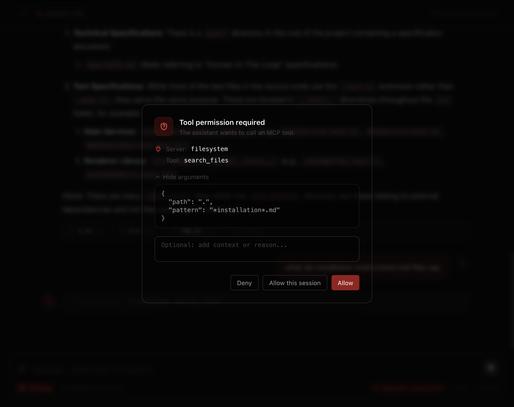

When a tool call requires approval, a popup appears inline in the chat showing the tool name, the server it belongs to, and the full arguments the model intends to pass. You can approve the call to let it proceed, deny it to cancel the invocation and inform the model, or choose to allow all future calls from that server for the rest of the session. The popup is non-blocking for the rest of the UI and resolves the moment you make a choice, keeping the conversation flow as smooth as possible.

**Per-server permission controls in Settings:**

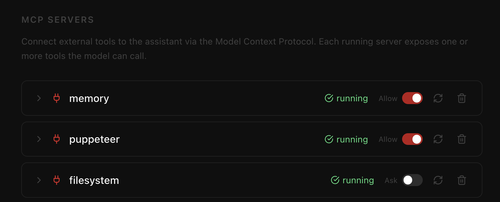

Each MCP server has its own permission mode, configurable from the Settings panel. You can set a server to require approval for every tool call, allow all calls automatically, or block the server entirely. These preferences persist across sessions, so frequently used read-only servers can be trusted once while more sensitive servers always pause for review.

**Per-chat override — requiring permissions for the current session:**

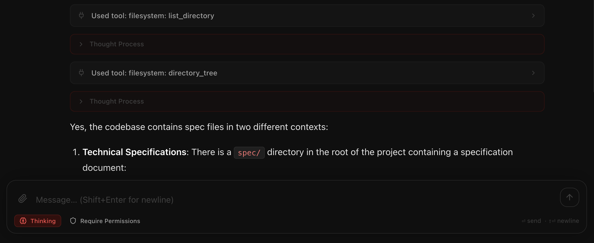

A dedicated button in the chat toolbar lets you enforce approval for all MCP tool calls within the current conversation, regardless of the server-level setting. This is useful when you want stricter oversight for a specific task without changing your global configuration. The toggle is visible and easy to reach so you can flip it at any point mid-conversation.

**Per-chat override — bypassing permissions for the current session:**

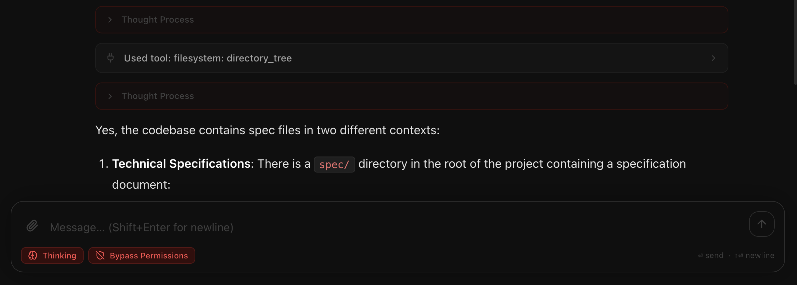

The inverse is also available. If you have a trusted server set to require approval and you want to run a long agentic task without interruption, you can bypass permission checks for the duration of the conversation. The bypass is scoped to the current chat only and resets when you start a new conversation, so your default settings are never permanently changed.

---

### Context Compaction

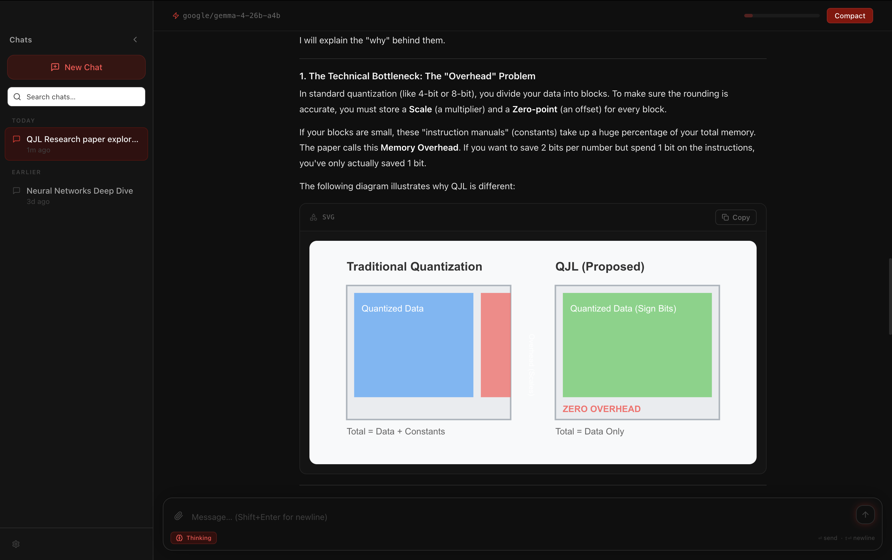

When the context bar approaches its limit, the **Compact** button lets you summarise the conversation and free context window space. The model produces a structured summary; all prior messages are replaced atomically in SQLite.

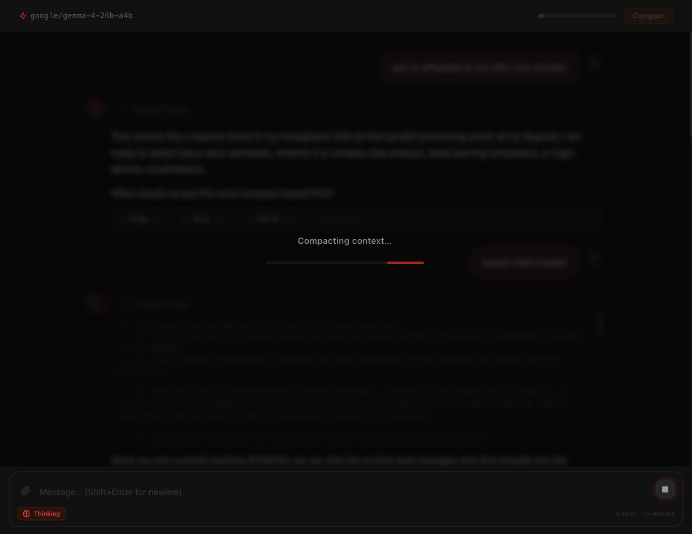

A full-screen overlay blocks input while the summary is being generated, then the chat reloads from the condensed history.


A toast pill confirms how many tokens were freed. The context bar resets and the conversation continues from the summary — no loss of context substance, just less verbatim history.

---

### Observability Logs

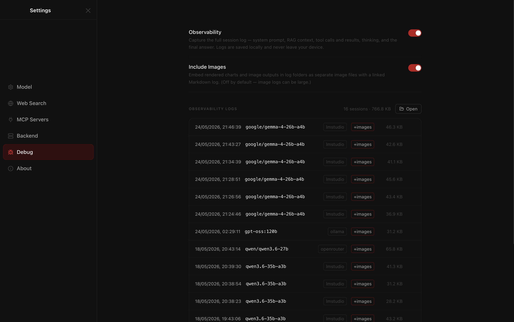

Desktop Intelligence features a complete session-tracing observability system. Enabled from the Settings panel under the Debug tab, this system compiles deep traces for each conversation. Every log tracks the raw system prompt, RAG retrieved context, model thinking blocks, tool calls and their results, messages sent, and the final answer.

With the optional image capture setting, rendered charts and base64 images from the chat are captured and saved as individual files alongside a linked Markdown log of the session. Logs are stored 100% locally on your machine, ensuring full privacy while providing full transparency into the inner workings of your models.

---

## Quick Start (Development)

> **End users: see [INSTALLATION.md](INSTALLATION.md) instead.**

```bash
# Install dependencies
npm install

# Start in development mode (Electron + Vite hot-reload)
npm run dev

# Run the test suite
npm test

# Build a production DMG
npm run package
```

The packaged app outputs to `dist/Desktop Intelligence-<version>-arm64.dmg`.

---

## Tech Stack

| Layer               | Technology                                                       |
| ------------------- | ---------------------------------------------------------------- |
| Shell               | Electron 31                                                      |
| Frontend            | React 18 + Vite + TypeScript (strict)                            |
| Styling             | Tailwind CSS v3 + shadcn/ui                                      |
| Markdown            | react-markdown + remark-gfm + remark-math + rehype-katex         |
| Diagrams            | Mermaid 11 (native SVG)                                          |
| Syntax highlighting | highlight.js                                                     |
| Database            | better-sqlite3 (SQLite)                                          |
| AI backends         | LM Studio · Ollama · NVIDIA Build · OpenRouter                   |
| Visualizations      | matplotlib via persistent python3 worker                         |
| MCP                 | Model Context Protocol (MCP) server manager — form + JSON config |
| Web search          | Brave Search API (optional MCP tool)                             |
| PDF parsing         | pdf-parse                                                        |
| Packaging           | electron-builder (macOS arm64 DMG)                               |
| Observability       | Session tracer writing plain and image logs locally              |

---

## Architecture Overview

```
Renderer (React)          Main Process (Node/Electron)
─────────────────         ──────────────────────────────
Layout / ChatArea         IPC handlers
MessageBubble             ├── FileProcessorService  (PDF → SQLite)
MarkdownRenderer          ├── RAGService            (SQLite full-text retrieval)
  ├── MermaidBlock        ├── ChatService           (SSE streaming → renderer)
  └── MatplotlibBlock     ├── SystemPromptService   (base prompt + user system prompt)
InputBar                  ├── DatabaseService       (chat history)
ModelStore (Context)      └── SettingsStore         (all settings persistence)
                          Managers
                          ├── ModelConnectionManager (health polling)
                          └── LMSDaemonManager       (lms CLI lifecycle)
```

All heavy work (PDF parsing, database writes, Python rendering, LM Studio API calls) runs in the Electron main process. The renderer is purely presentational and communicates exclusively through typed IPC channels via `contextBridge`.

---

## Debugging (Packaged App)

Since Electron swallows stdout in the packaged `.app`, launch from Terminal to see logs:

```bash
/Applications/"Desktop Intelligence.app"/Contents/MacOS/"Desktop Intelligence"
```

Key sentinel log lines:

| Log prefix                           | Meaning                           |
| ------------------------------------ | --------------------------------- |
| `[FileProcessor] 📄`                 | File received and being processed |
| `📄 PDF-PARSE EXTRACTED CHARACTERS:` | PDF text extraction succeeded     |
| `[RAG] 🧠 ingestDocument`            | Document being written to SQLite  |
| `🔥 VECTOR DB RESULTS COUNT:`        | RAG retrieval result count        |
| `🚀 FINAL LM STUDIO PAYLOAD:`        | Full JSON sent to LM Studio       |
| `[Python] ✅ matplotlib render OK`   | Chart rendered successfully       |
| `[Settings] ✅ Reload complete`      | Model reloaded with new settings  |

---

_2.6.0-alpha-6 (2026-05-24)_

Built with [Claude Code](https://claude.ai/claude-code)
