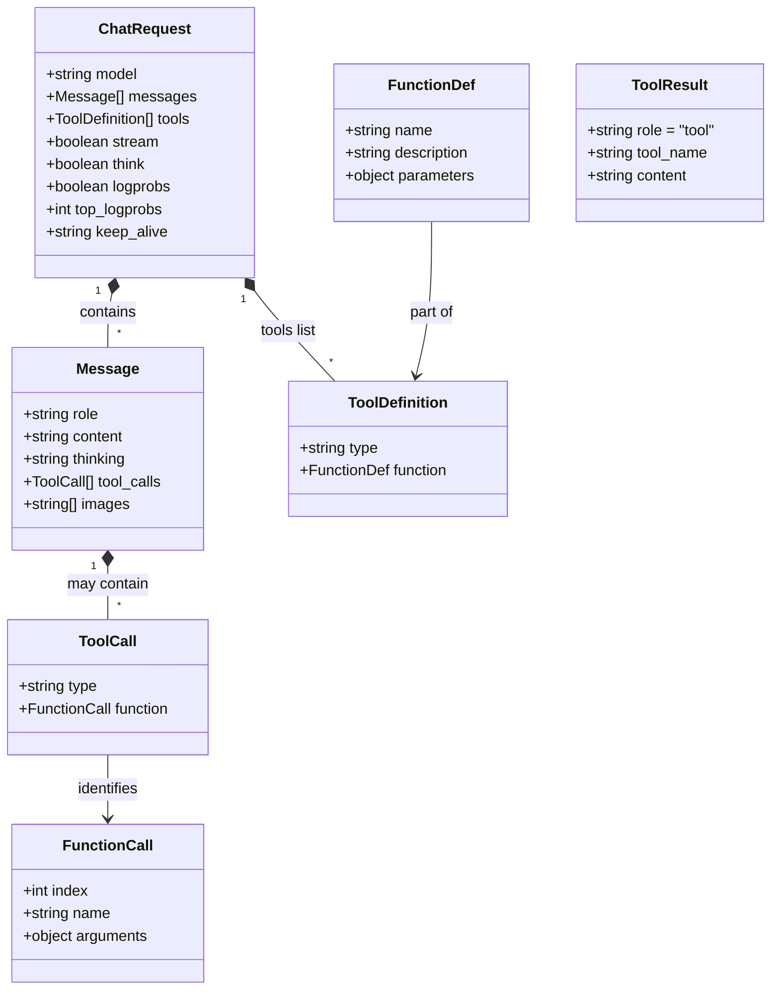
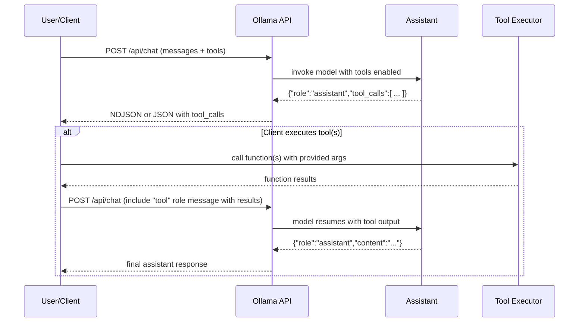

# Ollama Cloud Chat/Completion API

## Executive Summary  
Ollama Cloud provides a REST API for running open LLM models (“cloud models”) hosted by Ollama. Its endpoints mirror local usage (`http://localhost:11434/api/...`) and include chat completions (`POST /api/chat`), text completions (`POST /api/generate`), embeddings, and model management (list/pull/push/copy/etc). The cloud base URL is `https://ollama.com/api` and requires an API key (Bearer token) for all requests【20†L114-L122】. Both synchronous (single JSON response) and streaming (NDJSON) modes are supported. Ollama also offers OpenAI- and Anthropic-compatible endpoints under `/v1/` for easier migration【31†L76-L84】【56†L29-L38】. 

Authentication uses static API keys (set via `OLLAMA_API_KEY`) or CLI sign-in; no expiring OAuth tokens are needed【20†L114-L122】. Requests and responses use JSON with `Content-Type: application/json` (streamed responses use `application/x-ndjson`)【19†L76-L84】. The chat schema accepts `model`, an array of `messages` (`role` + `content`), optional `tools`, and control flags (`stream`, `think`, etc). The generate (completion) schema uses `model`, `prompt` (plus suffix, system, etc)【8†L83-L91】【10†L83-L90】. Responses include the generated text, model name, timing metrics, and optionally a chain-of-thought (`thinking`) or proposed tool calls. Error responses use standard HTTP codes (400/404/429/5xx) and a JSON `{ "error": "message" }` body【18†L84-L89】.

Ollama’s **tool-calling** enables the model to output a structured “function call” which the client can execute. In the request, clients provide a `tools` list of functions (with name, description, JSON schema parameters). If the model invokes a tool, the assistant response includes a `tool_calls` array with the chosen function and arguments【15†L298-L304】. The client then runs the function, appends its result as a new message with role `"tool"`, and re-queries the chat endpoint to continue the conversation【16†L372-L378】. The **thinking** (chain-of-thought) format uses a `think` flag in requests; when enabled, responses include an extra `message.thinking` field with the reasoning trace (before final `content`)【58†L130-L138】【58†L251-L254】.

Key implementation details: 
- **Rate limits and quotas:** Ollama Cloud uses GPU-time based quotas (not fixed tokens). Usage tiers (Free/Pro/Max) define concurrency limits (1/3/10 models simultaneously) and roughly 50× or more capacity【23†L139-L148】. Excess requests queue up or return 429 if capacity is exhausted【23†L139-L148】. Exact token QPS limits are unspecified.
- **Retries/backoff:** Standard practice of exponential backoff on 429/502 is advised (no official guidance found).
- **Error handling:** Clients should parse non-200 responses for an `error` message in JSON【18†L84-L89】 and handle 429 (rate limit) and 503 (overload) appropriately.
- **Security:** All cloud requests should use HTTPS with the Bearer token header. Store tokens securely (e.g. env var) and avoid logging them. For web front-ends, note that CORS rules apply (local Ollama can be configured via `OLLAMA_ORIGINS`【25†L334-L342】; for the cloud, origins must be allowed by Ollama’s CORS policy). No OAuth scopes currently exist – API keys grant full access【20†L114-L122】.
- **Observability:** For self-hosted Ollama, standard logging and tracing (e.g. via OpenTelemetry) can be enabled【60†L24-L33】. The Ollama Python client supports auto-instrumentation to emit traces/metrics (e.g. to SigNoz)【60†L24-L33】. Cloud usage has internal metrics but no public monitoring API.
- **Testing:** Unit tests can mock the API. Projects like Mokksy (“AI-mocks-Ollama”) provide mock servers for chat/completion endpoints【62†L384-L392】. Integration tests can run a local Ollama instance or use these mocks to simulate responses.
- **Pricing:** Ollama Cloud has Free/Pro/Max plans ($0/$20/$100 per mo) with usage measured in GPU time【23†L93-L102】【23†L139-L148】. Concurrency limits (cloud models) and session/weekly quotas apply. Overages are currently handled via queued requests; “pay-as-you-go” pricing is planned.
- **Migration:** Ollama supports OpenAI v1 endpoints (`/v1/chat/completions`, `/v1/completions`, `/v1/responses`, etc.)【56†L29-L38】【32†L73-L81】 and Anthropic’s `/v1/messages`【48†L88-L97】. Existing OpenAI/Claude clients can often be repointed with minimal code change (often only base URL and dummy API key change)【56†L29-L38】. Note differences: Ollama measures usage by compute time, defaults to long-lived model memory (configurable via `keep_alive`), and requires explicitly passing prompts into `prompt`/`messages` fields.

Below is a detailed breakdown of all aspects of the Ollama Cloud API.

## API Endpoints & Base URLs  
Ollama’s API is rooted at `/api`.  By default, a local Ollama server listens at `http://localhost:11434/api`. For the cloud service, use `https://ollama.com/api` and include a valid API key in the `Authorization` header【20†L114-L122】. The main endpoints are:

| Endpoint             | Method | Description |
|----------------------|--------|-------------|
| **POST** `/api/chat`  | POST   | Chat completion (Assistant responds to a list of messages)【10†L83-L90】. Supports streaming and tools. |
| **POST** `/api/generate` | POST   | Text completion from a prompt (like “single-turn” completions)【8†L83-L91】. Also supports streaming. |
| **POST** `/api/embed` | POST   | Generate text embeddings from input text【33†L81-L90】. |
| **GET**  `/api/tags`  | GET    | List available models (name, size, details)【34†L89-L97】. |
| **GET**  `/api/ps`    | GET    | List currently loaded models (with memory usage)【35†L89-L98】.  |
| **POST** `/api/show`  | POST   | Get metadata for a model (parameters, capabilities, etc.)【36†L90-L99】. |
| **POST** `/api/create`| POST   | Create (clone) a new model from an existing one (local only)【37†L83-L91】. |
| **POST** `/api/copy`  | POST   | Copy/rename a model locally【50†L83-L91】. |
| **POST** `/api/pull`  | POST   | Download a model from Ollama’s registry (e.g. `ollama pull`)【51†L83-L90】. |
| **POST** `/api/push`  | POST   | Upload a local model to Ollama registry (private models)【52†L83-L91】. |
| **DELETE** `/api/delete`| DELETE | Delete a local model【53†L83-L90】. |
| **GET**  `/api/version`| GET    | Get Ollama server version (e.g. `{"version":"0.12.6"}`)【54†L87-L91】. |

Each endpoint’s full URL is `<base_url>/api/...`. For cloud use `https://ollama.com` as the host【20†L114-L122】. For example, to list cloud models:
```bash
curl -H "Authorization: Bearer $OLLAMA_API_KEY" https://ollama.com/api/tags
```
This returns JSON like `{"models":[{...}]}`【34†L89-L97】.  

**OpenAI Compatibility:** For easier migration, Ollama also supports OpenAI-style endpoints. By pointing to `/v1/` paths (instead of `/api`), e.g. `/v1/chat/completions` or `/v1/responses`, many tools (OpenAI libs, Claude Code, etc.) can work with Ollama【31†L76-L84】【56†L29-L38】. These accept the same JSON fields as the official API. (For brevity, this doc focuses on the native `/api` interface.) 

## Authentication  
Local API calls (to `localhost:11434`) require no auth【20†L76-L85】. For **cloud usage**, every request must include `Authorization: Bearer <API_KEY>`. Create a key in your Ollama account and set, for example, `OLLAMA_API_KEY=your_key` in your env【20†L114-L122】. Example:
```bash
curl https://ollama.com/api/chat \
  -H "Authorization: Bearer $OLLAMA_API_KEY" \
  -d '{"model":"gpt-oss:20b","messages":[{"role":"user","content":"Hi"}]}'
```
(Ollama then verifies the key before processing.) API keys do not expire unless you revoke them manually【20†L128-L131】. The key is a secret string (no scopes or JWT); keep it secure (e.g. in environment variables, not in source). 

## Requests: Schemas and Parameters  
### Chat Endpoint (`POST /api/chat`)  
- **URL:** `<base>/api/chat` (e.g. `https://ollama.com/api/chat`).  
- **Headers:** `Content-Type: application/json`; `Authorization: Bearer <key>` if using cloud.  
- **Body (JSON):**  
  - `model` (string, required): model name (e.g. `"gemma3"`, `"qwen3"`, or a cloud model like `"gpt-oss:120b-cloud"`).  
  - `messages` (array, required): conversation history, each item an object with fields:
    - `role`: `"user"`, `"assistant"`, or `"system"`. 
    - `content`: string of message text (for vision-capable models, `content` can also be an array of `{type: "...", ...}` blocks, but typical usage is text).  
    - *(Optional)* `images`: array of images in base64 or binary (for vision models).  
    - *(Optional)* `tool_name`: when sending back a tool’s result as a message, use role `"tool"` and include `tool_name` (see Tools section).  
  - `tools` (array, optional): list of tool definitions (functions) the model may call (see below). 
  - `stream` (bool, default `true`): if `true`, respond with NDJSON streaming chunks; if `false`, return one JSON.  
  - `think` (bool or string): enable chain-of-thought. Use `true`/`false` or a level (`"high"`, `"medium"`, `"low"`) for models like GPT-OSS that require levels【58†L166-L168】.  
  - `format` (string or object, optional): request JSON-formatted output or use a JSON schema.  
  - `logprobs` (bool) / `top_logprobs` (int): return token log-probs (if model supports).  
  - `keep_alive` (string/number): how long (e.g. `"30m"` or seconds) to keep model loaded (default is server idle timeout).  
  - `options` (object, optional): runtime options (e.g. sampling params) – seldom needed.  
- **Example Request:**  
  ```bash
  curl https://ollama.com/api/chat -H "Authorization: Bearer $OLLAMA_API_KEY" -d '{
    "model": "gemma3",
    "messages": [
      {"role": "user", "content": "Why is the sky blue?"}
    ],
    "stream": false
  }'
  ```【10†L81-L88】  

### Generate/Completion Endpoint (`POST /api/generate`)  
Used for single-turn completions (non-chat).  
- **URL:** `<base>/api/generate`.  
- **Body (JSON):**  
  - `model` (string, required).  
  - `prompt` (string, required): text prompt.  
  - (Optional) `suffix`: text to append after generated content.  
  - (Optional) `system`: system prompt.  
  - (Optional) `images`: array of images for generation.  
  - Other flags: `stream`, `think`, `format`, `logprobs`, `keep_alive` similar to chat.  
- **Example Request:**  
  ```bash
  curl http://localhost:11434/api/generate -d '{
    "model": "gemma3",
    "prompt": "Why is the sky blue?"
  }'
  ```【8†L83-L91】  

The generate endpoint returns JSON with fields like `response`, `thinking`, etc (see below).

### Embeddings (`POST /api/embed`)  
- **URL:** `<base>/api/embed`.  
- **Body:**  
  - `model` (string), e.g. an embedding model (`"embeddinggemma"`).  
  - `input` (string or list of strings): text(s) to embed.  
  - Optional `truncate`, `dimensions`, `keep_alive`, etc.  
- **Response:** returns `{model, embeddings: [[...],...], ...}`【33†L89-L97】.

## Responses: Schema & Examples  
### Chat Response  
If `stream: false`, the API returns a single JSON object. For `POST /api/chat`, the response structure is:  
```json
{
  "model": "gemma3",
  "created_at": "2025-10-26T17:15:24.166576Z",
  "message": {
    "role": "assistant",
    "content": "The sky appears blue due to ...",
    "thinking": "Step 1: Sunlight is white...\nStep 2: Blue wavelengths scatter more...",
    "tool_calls": [ /* see Tools below */ ],
    "images": []
  },
  "done": true,
  "done_reason": "stop",
  "total_duration": 69132431,
  "load_duration": 26202210,
  "prompt_eval_count": 168,
  "prompt_eval_duration": 11741375,
  "eval_count": 6,
  "eval_duration": 11994943,
  "logprobs": null
}
```  

- `message.role` is `"assistant"`.  
- `message.content` is the final answer.  
- `message.thinking` (string, optional) contains the chain-of-thought reasoning if `think` was enabled (before content).  
- `message.tool_calls` (array) lists any tool the model chose to call (see Tool section).  
- `done`/`done_reason`: indicate generation completion.  
- Timing fields measure execution.  

If streaming (`stream: true`), the API returns one JSON object per line (NDJSON) with incremental parts. For chat streaming, each chunk includes the same fields, building up `message.content` (and `thinking` if present). For example, a streamed generate response might look like:  
```
{"model":"gemma3","created_at":"2025-10-26T17:15:24.097767Z","response":"That","done":false}
{"model":"gemma3","created_at":"2025-10-26T17:15:24.107889Z","response":"That's a fantastic","done":false}
{"model":"gemma3","created_at":"2025-10-26T17:15:24.166576Z","response":"That's a fantastic answer!","done":true}
```  
Here each line adds to the output. In client code, you parse NDJSON line-by-line. Errors mid-stream are returned as `{"error":"msg"}` in NDJSON【18†L84-L89】.

### Generate Response  
For `POST /api/generate`, the non-stream response is:  
```json
{
  "model": "gemma3",
  "created_at": "2025-10-26T17:15:24.166576Z",
  "response": "Because molecules in the atmosphere scatter sunlight.",
  "thinking": "Sunlight contains blue... (chain-of-thought)",
  "done": true,
  "done_reason": "stop",
  "total_duration": 12345678,
  "load_duration": 2345678,
  "prompt_eval_count": 50,
  "prompt_eval_duration": 1234567,
  "eval_count": 5,
  "eval_duration": 3456789,
  "logprobs": null
}
```  
Field names differ (`response` vs `message.content`) but semantics are similar【9†L90-L99】.

## Streaming vs Non-Streaming  
By default, Ollama streams outputs. In both chat and generate, set `"stream": false` to get one JSON payload【19†L76-L84】. When streaming (`stream: true`), set `Accept: text/event-stream` (some clients do this automatically). The stream is NDJSON (`application/x-ndjson`) with one JSON per line. Clients should parse line-by-line, concatenating `message.content` (and optionally `message.thinking`) until `done:true`【19†L76-L84】【58†L171-L180】.

Streaming is ideal for real-time UI (chat interfaces). If disabled, the full output is only available once generation finishes (good for batch tasks). Errors: if an error occurs mid-stream, a final line `{"error": "..."}`
is sent【18†L84-L89】, and the stream stops.

## Tool Calling (Function API)  
Ollama’s “tools” let the model output structured function calls. The workflow is:

1. **Define tools:** In the chat request, include a `tools` array. Each entry has `"type":"function"` and a `"function"` object with:
   - `name`: function identifier (string).  
   - `description`: what it does.  
   - `parameters`: a JSON Schema describing function arguments.  

   Example tool definition (in request)【15†L298-L304】:
   ```json
   "tools": [
     {
       "type": "function",
       "function": {
         "name": "get_temperature",
         "description": "Get current temp for a city",
         "parameters": {
           "type": "object",
           "required": ["city"],
           "properties": {
             "city": {"type": "string", "description": "City name"}
           }
         }
       }
     }
   ]
   ```
2. **Model emits tool call:** If the model chooses to use a tool, the assistant message will contain a `tool_calls` entry instead of normal `content`. For example, the API response may include:【16†L370-L378】
   ```json
   "message": {
     "role": "assistant",
     "tool_calls": [
       {"type":"function",
        "function":{
          "index":0, 
          "name":"get_temperature",
          "arguments":{"city":"New York"}
        }
       }
     ]
   }
   ```
   Here `index` points to the tool in your `tools` list. This tells the client: “Call the function `get_temperature({"city":"New York"})`”.
3. **Client executes and continues:** The client should run the corresponding tool (e.g. call the weather API), then add a new message to the conversation with `role:"tool"`, matching `tool_name`. For example:  
   ```json
   {"role":"tool","tool_name":"get_temperature","content":"22°C"}
   ```
4. **Re-submit to /chat:** Send a new `POST /api/chat` with the full updated `messages` (including user, assistant-with-tool, and tool-result). The model will then continue the conversation or finalize the answer【16†L370-L378】. 

This loop can repeat for multi-turn tool execution. The client is responsible for ensuring only intended tools run (safely). Unrecognized tool names or malformed arguments should be rejected by the client. 

In summary, tool-calling involves the model outputting a JSON function call and the client responding with the function result. The exact JSON schemas are:
- Request `tools[]`: objects with `{type:"function", function:{name,description,parameters:JSONSchema}}`【15†L298-L304】.  
- Assistant `tool_calls[]`: objects with `{type:"function", function:{index:int, name:string, arguments:object}}`【14†L83-L91】【16†L370-L378】.  
- Tool result message: role `"tool"`, with `tool_name` and the function output in `content`【16†L370-L378】.

*Example:* Request with a temperature tool【14†L81-L88】:
```bash
curl .../api/chat -d '{
  "model": "qwen3",
  "messages":[{"role":"user","content":"Temp in NYC?"}],
  "stream":false,
  "tools":[
    {"type":"function","function":{
       "name":"get_temperature",
       "description":"Get temperature for a city",
       "parameters":{
         "type":"object","required":["city"],
         "properties":{"city":{"type":"string"}} 
       }
    }}
  ]
}'
```  
Response may be:  
```json
{
  "message": {
    "role":"assistant",
    "tool_calls":[
      {"type":"function","function":{
         "index":0,"name":"get_temperature","arguments":{"city":"New York"}
      }}
    ]
  }
}
```【14†L81-L88】. Then client executes `get_temperature`, appends the tool result, and re-calls chat to finish.

## Thinking (Chain-of-Thought)  
Ollama models can emit internal reasoning. By setting `"think": true` (or `"think":"high"` etc.), the response will include a `message.thinking` field with intermediate reasoning【58†L130-L138】, separate from the final `message.content`. For example【58†L130-L138】:  
```bash
curl http://localhost:11434/api/chat -d '{
  "model": "qwen3",
  "messages": [{"role":"user","content":"How many letters ‘r’ in strawberry?"}],
  "think": true,
  "stream": false
}'
```  
The response JSON will contain both `"message.thinking": "Count letters one by one..."` and `"message.content": "There are 2 letters 'r'."`. In streaming mode, `message.thinking` tokens arrive before `message.content`. Client code can detect the switch to separate “thinking” vs final answer (see [58] lines 179–204).  

Most Ollama models (like Qwen, Gemma) support boolean `think`. GPT-OSS models require levels: set `think: "low"`, `"medium"`, or `"high"`. Simply using `true` is ignored for GPT-OSS【58†L166-L168】. By default, reasoning is enabled for supported models in the CLI/API【58†L251-L254】. Use `"think": false` to turn it off. 

### Thinking Example  
```bash
curl -H "Authorization: Bearer $OLLAMA_API_KEY" https://ollama.com/api/chat -d '{
  "model":"qwen3",
  "messages":[{"role":"user","content":"What is 17×23?"}],
  "think": true,
  "stream": false
}'
```  
Might yield:
```json
{
  "message": {
    "thinking": "17 * 23, step-by-step: ...",
    "content": "391"
  }
}
```  

## Headers, Content Types, & Other Protocol Details  
- **Headers:** Send `Content-Type: application/json`. For cloud use `Authorization: Bearer <key>`【20†L114-L122】.  
- **Streaming:** For streaming, use `Accept: application/x-ndjson` (the API will send chunked NDJSON by default when `stream:true`)【19†L76-L84】.  
- **Multipart:** No file uploads; images are base64 in JSON (see vision docs).  
- **URL Paths:** All requests are under `/api`; do not include `/api` twice. The OpenAI-compatible `/v1/...` is simply an alias that routes to the same handlers (e.g. `/v1/chat/completions` → `/api/chat`)【56†L29-L38】.  
- **CORS:** If calling from a browser, the Ollama server must allow your origin. Locally, allowed origins default to `127.0.0.1`/`0.0.0.0` but can be configured via `OLLAMA_ORIGINS`【25†L334-L342】. The cloud endpoint presumably has its own CORS policy. For security, avoid exposing API keys in client-side code.

## Rate Limits, Quotas & Usage  
Ollama Cloud usage is governed by subscription tiers【23†L34-L42】【23†L93-L102】: Free, Pro ($20/mo), and Max ($100/mo).  
- **Usage Measurement:** Charged by GPU compute time, not raw tokens. Actual throughput depends on model/hardware. There's no fixed token quota【23†L108-L115】.  
- **Session Limits:** Each plan has concurrent model limits (Free=1, Pro=3, Max=10) and usage quotas that reset hourly/weekly【23†L139-L148】. For example, Pro allows “50× more usage than Free”【23†L42-L48】【23†L93-L102】.  
- **Concurrency:** If you try to run more models in parallel than allowed, excess requests queue. If queue is full, new requests get rejected (likely 429 or 503)【23†L139-L148】.  
- **Rate Limiting:** Official docs do not specify QPS limits. 429 is used when you exceed concurrency or usage limits【18†L84-L89】. Clients should implement retry with backoff on 429/503.  

Example from Pricing FAQ:  
> “Requests beyond your plan’s concurrency limit are queued… If the queue is full, the request will be rejected until a slot opens”【23†L139-L148】.  

No public rate-limit headers are documented. Monitor error 429 as a signal to pause.

## Error Handling  
Responses on error use HTTP status codes and a JSON body:  
- **400 Bad Request:** e.g. malformed JSON or invalid model name. Body: `{"error":"..."} `.  
- **404 Not Found:** e.g. unknown endpoint or model.  
- **429 Too Many Requests:** rate limit or concurrency exceeded【18†L84-L89】.  
- **503 Service Unavailable:** server overloaded or queue full. (FAQ suggests a 503 on overload【25†L461-L464】.)  
- **500 Internal Error:** unexpected server error.  

Example error JSON:  
```json
HTTP/1.1 400 Bad Request
{"error":"Model not found: unicornModel"}
```【18†L84-L89】.  

Clients should check `response.ok` or status code, and parse `error`. On 429/503, apply retry/backoff. In streaming mode, errors are sent as NDJSON with `{"error":...}` as a standalone line【18†L84-L89】.

## Pagination/Cursoring  
Most list endpoints (e.g. `/api/tags`) return all results at once with no cursor. There is no built-in pagination parameter or cursor. If you have an extremely large number of models, the response may be large. No examples of paginated responses are documented.

## SDKs and Client Libraries  
### Python (`ollama` package)  
Official Python SDK is available via `pip install ollama`【41†L280-L288】. Usage is straightforward:  
```python
from ollama import chat
response = chat(model='gemma3', messages=[{'role':'user','content':'Hello'}])
print(response.message.content)
```  
It returns a `ChatResponse` object with attributes (`message.content`, `message.thinking`, etc)【41†L286-L295】. For streaming:  
```python
for part in chat(model='gemma3', messages=msgs, stream=True):
    print(part.message.content, end='', flush=True)
```  
To use cloud models with the cloud API:  
```python
from ollama import Client
client = Client(host='https://ollama.com', headers={'Authorization': 'Bearer '+API_KEY})
for part in client.chat('gpt-oss:120b', messages=[{'role':'user','content':'Compute 2+2'}], stream=True):
    print(part.message.content, end='')
```【41†L369-L378】.  

The Python client also supports local operation (no host param) and provides functions for all endpoints: `ollama.generate()`, `ollama.list()`, `ollama.pull()`, `ollama.create()`, etc【41†L447-L456】. Errors raise exceptions. An `AsyncClient` variant exists for `asyncio` usage【41†L403-L412】.  

### JavaScript/Node.js (`ollama` npm)  
Install via `npm i ollama`. Usage (ESM):  
```js
import { Ollama } from 'ollama';
const ollama = new Ollama({ host:'https://ollama.com', headers:{Authorization:'Bearer '+API_KEY} });
const stream = await ollama.chat({
  model: 'gpt-oss:120b',
  messages: [{role:'user', content:'Explain quantum computing.'}],
  stream: true
});
for await (const part of stream) {
  process.stdout.write(part.message.content);
}
```【46†L339-L348】【46†L362-L371】.  

Alternatively, default `new Ollama()` points to `http://localhost:11434`. The JS client API mirrors the REST schema (see [46]). There are also `generate()`, `pull()`, `push()`, `create()`, etc.  Errors throw exceptions or return error objects.

### Other SDKs  
Ollama also provides [OpenAI-compatible endpoints](https://docs.ollama.com/api/openai-compatibility) (e.g. `/v1/chat/completions`) so existing OpenAI or Claude clients can be reused. For instance, using the `openai` Python lib with `base_url='http://localhost:11434/v1'` will call Ollama【56†L50-L59】. (Key is ignored by Ollama but required by libraries.) The Anthropic `anthropic` SDK can likewise be pointed to Ollama’s `/v1/messages`【48†L102-L110】.  

### Example Code  
Below are example request/response flows:

- **Chat (no streaming):**  
  ```bash
  curl -X POST http://localhost:11434/api/chat -d '{
    "model":"gemma3",
    "messages":[{"role":"user","content":"Hello, Ollama!"}],
    "stream":false
  }'
  ```  
  **Response:**  
  ```json
  {
    "model": "gemma3",
    "message": {"role":"assistant","content":"Hi there!","thinking":""},
    "done": true
  }
  ```  

- **Generate (streaming):**  
  ```bash
  curl http://localhost:11434/api/generate -d '{
    "model":"gemma3",
    "prompt":"Once upon a time",
    "stream":true
  }'
  ```  
  **Response (NDJSON):**  
  ```
  {"model":"gemma3","created_at":"...","response":"Once","done":false}
  {"model":"gemma3","created_at":"...","response":" Once","done":false}
  {"model":"gemma3","created_at":"...","response":" once upon a time, ...","done":true}
  ```  

- **Tool call example:** (see Tools section above)  

- **Thinking example:** (see Thinking section above)  

## Security Best Practices  
- **API Key Storage:** Treat `OLLAMA_API_KEY` like any secret. Store in environment variables or a secrets manager, not in source code or logs.  
- **TLS:** Always use HTTPS for cloud endpoint. If self-hosting behind a proxy, ensure TLS termination.  
- **CORS:** Ollama’s CORS policy must allow your front-end origin if calling from a browser. By default, local CLI allows only loopback origins【25†L334-L342】.  
- **Scopes/Permissions:** Currently, keys have full access. Avoid sharing keys across teams. Consider rotating keys periodically.  
- **Least Privilege:** On local installs, restrict `OLLAMA_ORIGINS` to required domains. For cloud, do not expose your key; use a backend proxy if front-end access needed.  

## Deployment & Network Considerations  
- **Cloud Region:** Ollama hosts models primarily in the U.S., with possible routing to Europe/Singapore for load【23†L151-L159】. There is no user-configurable endpoint for region; use the global `ollama.com` domain. Expect network latency to add to total response time.  
- **VPC/Private Networking:** Ollama Cloud does not currently offer VPC endpoints or on-prem cloud instances. All traffic to `ollama.com` goes over the public internet (TLS). For sensitive use, consider self-hosted Ollama on your infrastructure (Docker, Kubernetes, etc.).  
- **Self-Hosting:** Users can deploy the Ollama server locally or on cloud VMs. In that case, the same API applies on the host’s IP. System requirements (GPU/CPU, memory) depend on model size. Use `keep_alive` to control memory residency (default 5min idle)【25†L420-L429】.  
- **Latency:** Ollama targets low time-to-first-token. Running smaller local models yields faster results; larger cloud models may have higher latency. Use streaming to start seeing text sooner.  
- **Load Balancing:** The Ollama Python/JS clients accept extra HTTPX/custom headers; you can point them at a load balancer if using multiple Ollama backends.  
- **Scale:** Concurrency (parallel requests) in self-hosting is controlled by `OLLAMA_MAX_LOADED_MODELS` and `OLLAMA_NUM_PARALLEL` env vars【25†L469-L478】. In cloud, concurrency is managed by your plan【23†L139-L148】.

## Observability (Logging, Metrics, Tracing)  
- **Server Logs:** Self-hosted Ollama logs to STDOUT/JSON. You can integrate with syslog or ELK. Cloud internals are not exposed.  
- **Client Logging:** The Python and JS libraries use standard loggers (httpx in Python). Enabling debug logs can help troubleshoot request/response.  
- **Telemetry:** The Ollama Python package supports OpenTelemetry instrumentation (via `opentelemetry-instrumentation-ollama`)【60†L24-L33】. This auto-instruments API calls and exports traces/metrics/logs to monitoring tools. For example, installing:
  ```bash
  pip install opentelemetry-instrumentation-ollama
  opentelemetry-bootstrap --action=install
  export OTEL_EXPORTER_OTLP_ENDPOINT="https://<endpoint>"
  opentelemetry-instrument python my_app.py
  ```
  will capture latency and token counts【60†L24-L33】. Similar instrumentation can be done in Node.js with OpenTelemetry HTTP instrumentors.  
- **Metrics:** Monitor request latency, error rate, throughput. For cloud, use Ollama’s usage dashboard to track GPU-hours consumed.  

## Testing Strategies  
- **Unit Tests:** Mock the API endpoints. You can simulate HTTP responses or use libraries like Mokksy’s Ollama mock server (AI-Mocks-Ollama)【62†L384-L392】. For example, define mock responses for known inputs and verify the client handles them.  
- **Integration Tests:**  
  - *Local Ollama:* Run a local Ollama server (Docker image or installed) in your test suite. Call it just like cloud API. Use small models for speed (e.g. `gemma3`).  
  - *Mock Endpoints:* Use test servers (MockOllama) to return canned JSON. Mokksy provides Kotlin/Java examples of mocking streaming and non-streaming responses【62†L275-L284】【62†L389-L392】.  
  - *Edge Cases:* Test error handling by returning 500/429 with `{error}` payload.  

## Billing & Pricing Overview  
Ollama Cloud pricing is subscription-based【23†L34-L42】, not per-token. Plans include:
- **Free ($0):** Unlimited public models; light usage of cloud compute; 1 concurrent cloud model.  
- **Pro ($20/mo):** All Free features + run 3 cloud models concurrently; ~50× more usage than Free【23†L42-L48】.  
- **Max ($100/mo):** All Pro features + 10 concurrent models; ~5× more usage than Pro【23†L42-L48】.  
There are session (5-hour) and weekly resets【23†L93-L102】. Usage is GPU time (shorter prompts and cached contexts cost less). Over-usage is queued. “Pay-as-you-go” add-on pricing is planned. (For on-prem, pricing is free or as per Nvidia Cloud Provider costs.)  

## Migration & Compatibility  
To migrate from other providers:  
- **OpenAI:** Use Ollama’s OpenAI-compatible endpoints. Set base URL to `https://ollama.com/v1/` (and dummy API key). Most OpenAI parameters (`model`, `messages`, `stream`, `temperature`, etc.) are supported with identical semantics【32†L23-L32】. However, rate limit and billing differ (no token quota, see above).  
- **Anthropic/Claude:** Set `ANTHROPIC_BASE_URL=https://ollama.com/v1` and use the Anthropic SDK as-is【48†L102-L110】.  
- **Differences:** Ollama may default to different sampling params; check and set parameters explicitly. Chain-of-thought, logprobs, or certain advanced features may be experimental or model-specific. Always validate outputs when switching backends.  

## Entity-Relationship Diagrams



This UML diagram shows how chat requests and messages relate to tool definitions and calls.

## Sequence Diagram: Tool-Calling Flow



This sequence illustrates: (1) user sends chat with tools; (2) assistant responds with a tool call; (3) client executes tool; (4) client sends tool result; (5) assistant completes the answer.

## Endpoint & Parameter Comparison

| **Endpoint**               | **Method** | **Key Input Fields**                   | **Key Output Fields**                    | **Notes**               |
|----------------------------|------------|-----------------------------------------|------------------------------------------|-------------------------|
| `/api/chat`                | POST       | `model`, `messages[]`, `stream`, `think` | `message.content`, `message.thinking`, `message.tool_calls`【10†L83-L90】【58†L130-L138】 | Chat completion        |
| `/api/generate`            | POST       | `model`, `prompt`, `stream`, `think`     | `response`, `thinking`                  | Text completion        |
| `/api/embed`               | POST       | `model`, `input[]`                       | `embeddings`【33†L89-L97】              | Text embeddings        |
| `/api/tags`                | GET        | —                                       | `models[]` (list of model meta)【34†L89-L97】 | List models            |
| `/api/ps`                  | GET        | —                                       | `models[]` (running models)【35†L89-L98】 | Running (loaded) models |
| `/api/show`                | POST       | `model`, `verbose?`                     | Model metadata (capabilities, license)【36†L90-L99】 | Model details          |

See API docs for full parameter lists. (All requests use JSON bodies and expect JSON replies.)

## Error Codes

| **HTTP Code** | **Meaning**                     | **Example Situation**                                  |
|---------------|---------------------------------|--------------------------------------------------------|
| 200           | OK                              | Successful generation                                  |
| 400           | Bad Request                     | Invalid JSON or missing required field【18†L84-L89】  |
| 404           | Not Found                       | Model or endpoint not found                            |
| 429           | Too Many Requests / Rate Limit  | Concurrency or usage limit exceeded【18†L84-L89】      |
| 500           | Internal Server Error           | Unexpected server error                                |
| 502           | Bad Gateway / Overload          | Server overloaded / self-hosted queue full【25†L461-L464】 |

Non-200 responses include a JSON `{ "error": "message" }` body. Clients should handle these codes appropriately (retry on 502/429 with backoff, abort on 400/404, etc.).

## Conclusion  
Ollama Cloud’s chat/completion API offers a feature-rich, open-LLM platform with first-party support for tools, reasoning, embeddings, and compatibility layers. By following the specifications above (endpoints, schemas, auth, etc.), developers can build robust clients in Python, Node.js, or any language. The official documentation and SDKs【10†L83-L90】【46†L339-L348】【41†L286-L295】 provide concrete examples. Where behavior is unspecified (rate limits, certain error cases), the client should fail gracefully or consult Ollama support. Use the tables and diagrams above as quick references when implementing a complete Ollama-based application. 

**Sources:** Ollama official docs (API Reference, Cloud docs, Pricing FAQs) and SDK READMEs【10†L83-L90】【20†L114-L122】【23†L139-L148】【41†L286-L295】【46†L339-L348】.